# Flowchart Quản Lý Phiếu Nhập Hàng

## 1. Xem Danh Sách Phiếu Nhập (GET /api/imports)

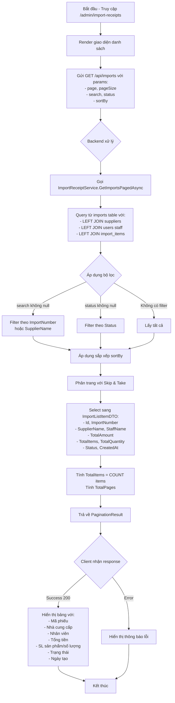

## 2. Xem Chi Tiết Phiếu Nhập (GET /api/imports/{id})

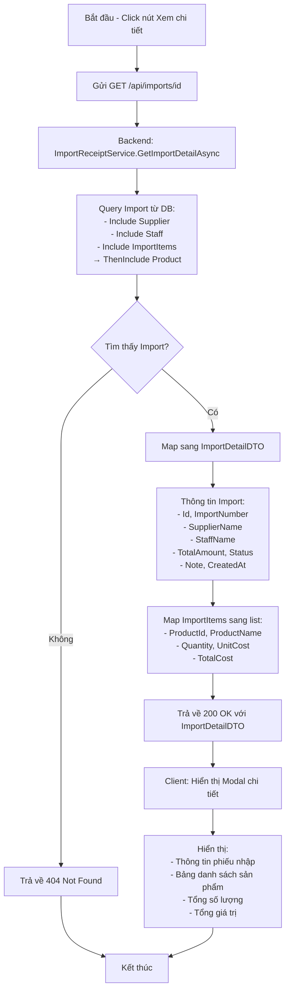

## 3. Tạo Phiếu Nhập Mới (POST /api/imports)

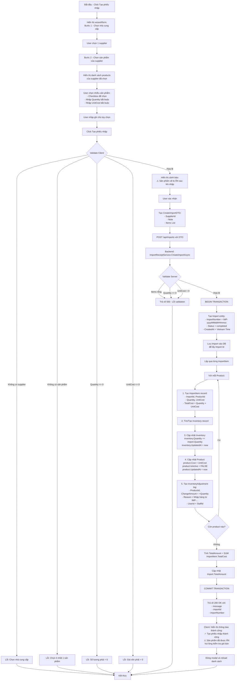

## 4. Cập Nhật Trạng Thái Phiếu Nhập (PATCH /api/imports/{id}/status)

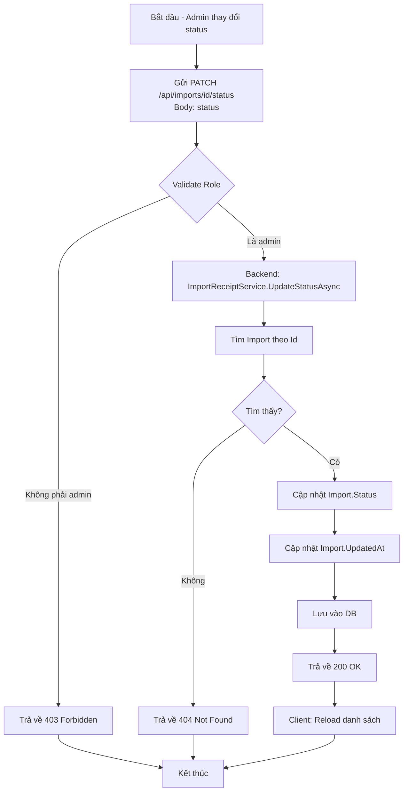

## 5. Luồng Import Excel Sản Phẩm (POST /api/import/products)

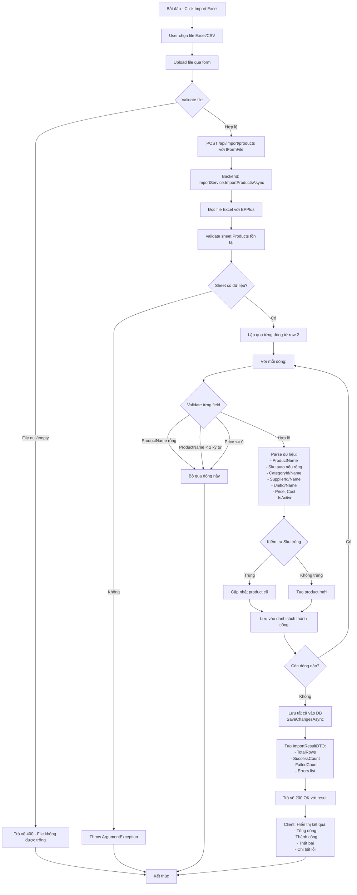

## 6. Tải Template Import (GET /api/import/template/products)

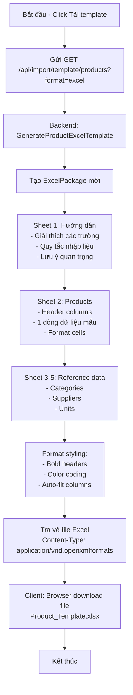

## Tổng Quan Quy Trình Nhập Hàng

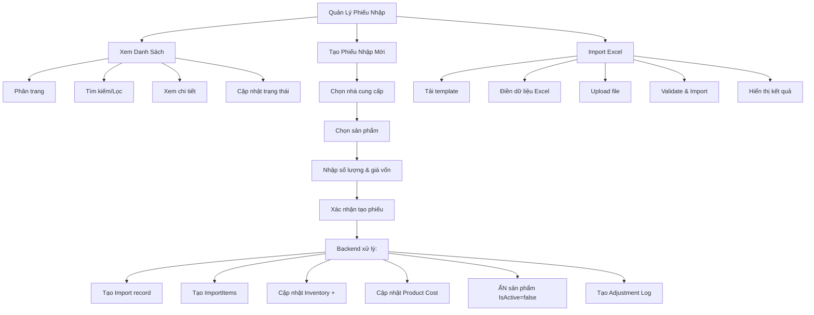

## Luồng Dữ Liệu Chi Tiết

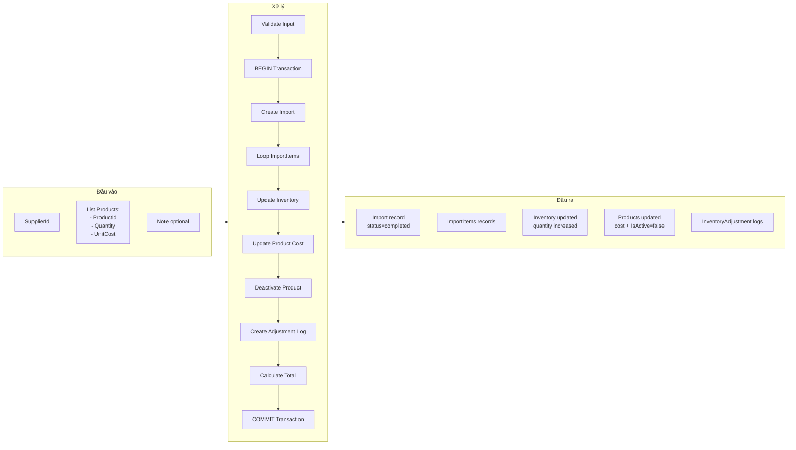

## Quy Tắc Nghiệp Vụ Quan Trọng

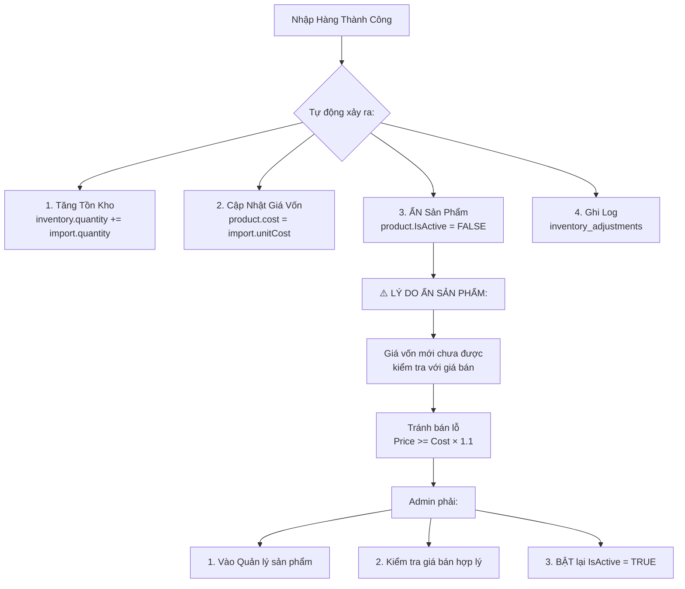

## So Sánh 2 Cách Nhập Hàng

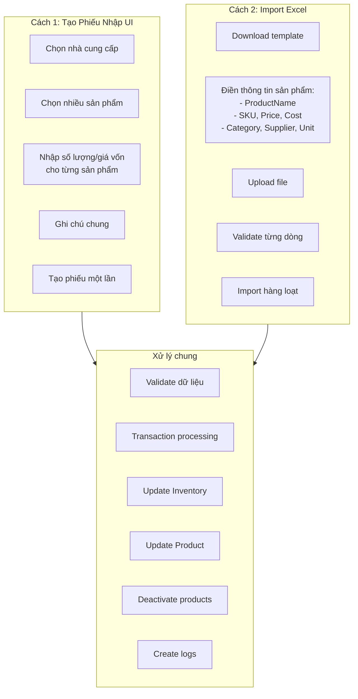

## Trạng Thái Phiếu Nhập

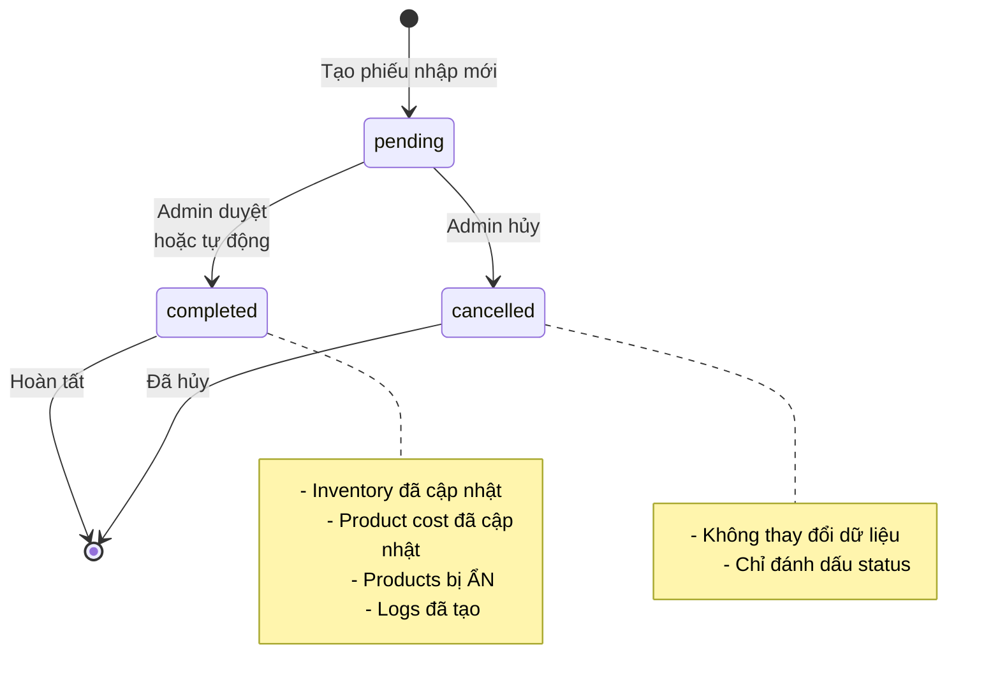
